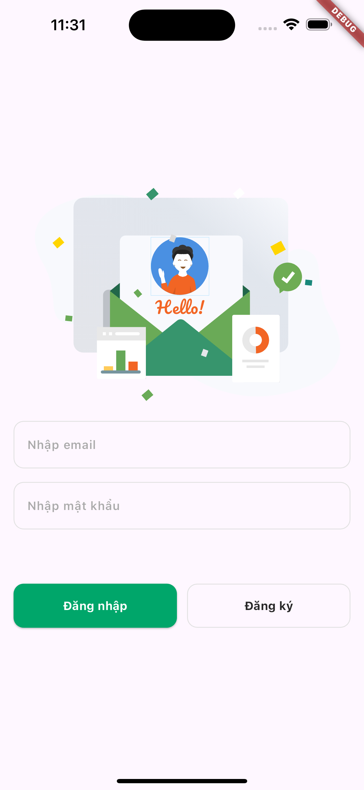
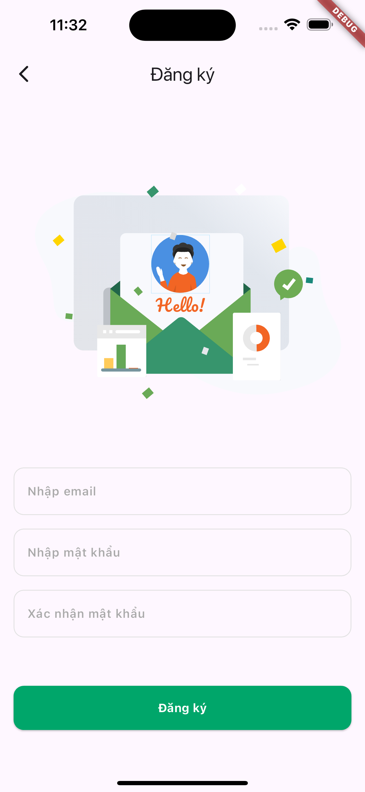
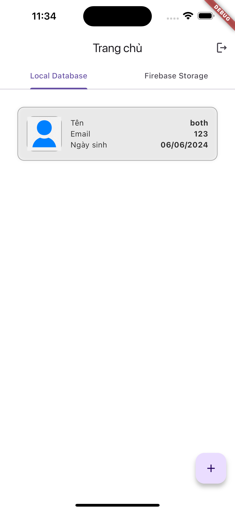
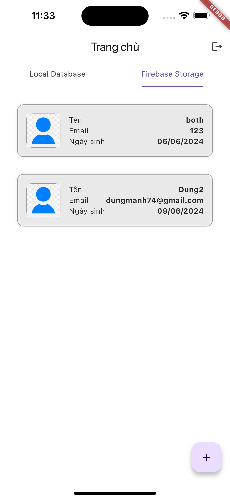
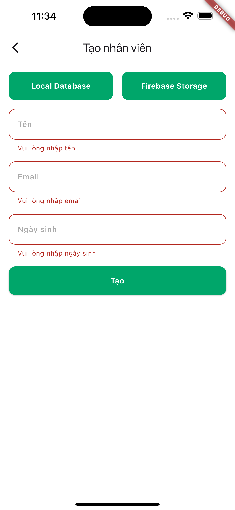
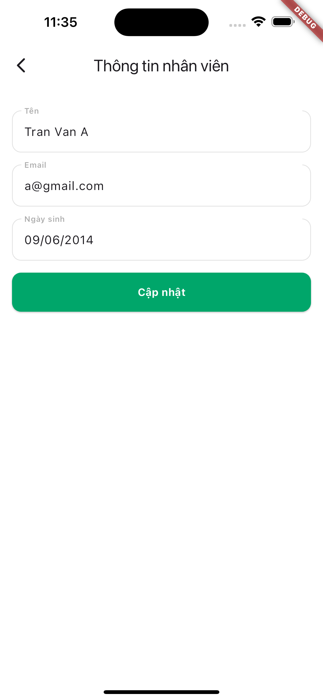
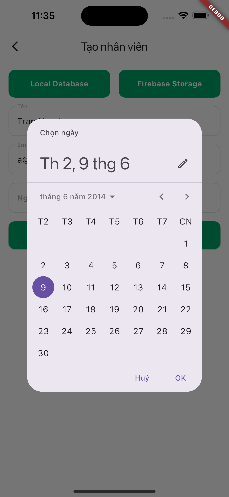
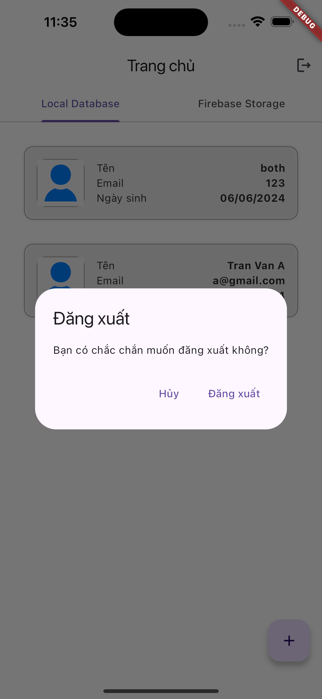

# App quản lý nhân viên
# Demo
<table>
  <tr>
    <td></td>
    <td></td>
     <td></td>
    <td></td>
   </tr> 
  <tr>
    <td></td>
    <td></td>
    <td></td>
    <td></td> 
   </tr> 
</table>

# Mô hình sử dụng: MVC
    - Model: Là nơi chứa dữ liệu, thực hiện các thao tác CRUD với dữ liệu.
    - View: Là nơi hiển thị dữ liệu, tương tác với người dùng.
    - Controller: Là nơi điều khiển luồng dữ liệu giữa Model và View.
## State Management:
    - SetState: Sử dụng cho các trạng thái đơn giản hoặc cần cập nhật trực tiếp trên UI.
    - ValueNotifier: Sử dụng để theo dõi thay đổi trong giá trị và thông báo cho các widget khác về những thay đổi này
    - ValueListenableBuilder: một widget trong Flutter được sử dụng để xây dựng giao diện người dùng dựa trên các thay đổi của một ValueNotifier
## Firebase:
    - *Firebase Auth*: Đăng nhập, đăng ký.
    - *Firebase Firestore*: Lưu trữ dữ liệu nhân viên.
## Local Database:
    - Floor Database: Cung cấp SQLite cho app
## Các màn hình chính :
    - Login: Đăng nhập.
    - Register: Đăng ký.
    - Home: Màn hình chính.
    - CreateStaff: Tạo mới nhân viên, chỉnh sửa nhân viên
## Chạy ứng dụng:
    - Clone project về máy.
    - Cài đặt Android Studio hoặc Visual Studio Code.   
    - Cài đặt Flutter SDK.
    - Mở project bằng Android Studio hoặc Visual Studio Code, chạy lệnh 'flutter run'
## Cài đặt app trên máy thật:
    - Build -> Flutter -> Build APK: tải file APK về máy và cài đặt.